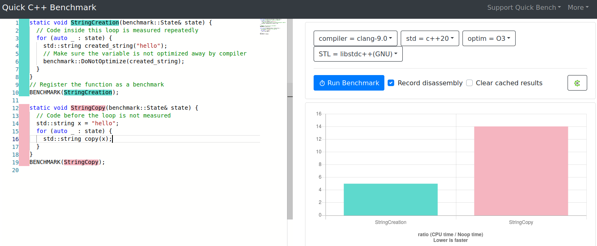

# CPP Optimizations Diary

Optimizing code in C++ is something that no one can resist. You can have fun
and pretend  that you are doing something useful for your organization at the same time!

In this repository, I will record some simple design patterns to improve your code 
and remove unnecesay overhead in **C++**.

## Rule 1: measure first (using _good_ tools)

The very first thing any person concerned about perfomance should do is:
 
- **Measure first** and **make hypothesis later**.

Me and my colleagues are almost always wrong about the reasons a piece of code is
be slow. 

Sometimes we are right, but it is really hard to know in advance ho refactoring will
improve performance. Good profiling tools show in minutes the "low hanging fruits": minimum work, maximum benefit!

Summarizing: 10 Minutes profiling can save you hours of work guessing and refactoring.

My "goto" tools in Linux are [Hotspot](https://github.com/KDAB/hotspot) and 
[Heaptrack](https://github.com/KDE/heaptrack). I understand Windows has similar
tools too.

In the benchmark war, if you are the soldier, these are your rifle and hand granades.

Once you know which part of the code deserves to be optimized, you might want to use
[Google Benchmark](https://github.com/google/benchmark) to optimize a very specific
class of function.

You can even run it Google Benchmark online here: [quick-bench.com](http://quick-bench.com/G7B2w0xPUWgOVvuzI7unES6cU4w).

Sex is good, but have you ever shown shown to someone else is he wrong about something
using **quick-bench.com**?

## Rule 2: learn good design patterns, use them by default

If you are a seasoned C++ expert, you probably have already a set of rules in your head
that you always follow.

They help you looking like a bad-ass/rockstar/10X engineer to your colleagues, 
whenever you casually drop a 
`std::vector<>::reserve` in the code and get a considerable performance improvement.

Hopefully the examples in this repository will help you achieving this guru status
and, as a side, effect, save the planet from global warning, sparing useless CPU
cycles from  being wasted.

(The, of course, someone on the other side of the world will write her/his 
application in Python and all your effort save electricity will be lost).

I am kidding, Python developers, we love you!

> Narrator: he was not kidding...

# Optimization examples

## "If you pass that by value one more time, I swear to god that..."

TODO

## std::vector<>: your best friend

TODO

- "I have learnt linked-lists at university, should I use them?" Nooope.

- You don't need a `std::map<>` for that.

- Small vector optimization.

## "It is just a string, how bad could that be?"

TODO

- When not to worry: small string optimization.

## Don't compute that twice

TODO

- Example: matrix multiplications.

- Double for-loop: elegance or performance?

## Fantastic data strucutres and where to find them

TODO

