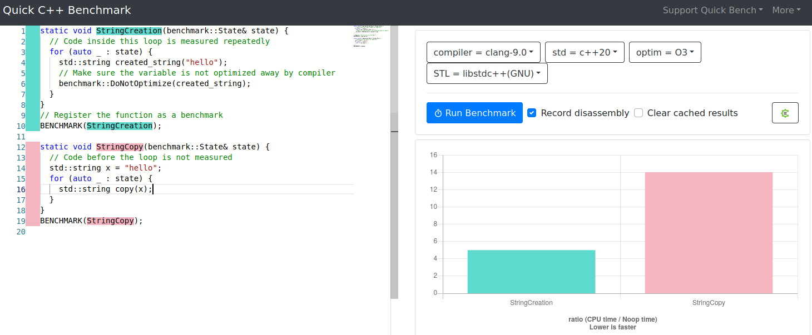

# 前言：关于我
[en](README.md)

我的名字是[Davide Faconti](https://twitter.com/facontidavide)，我从事的工作是最棒的工作之一：我在**机器人技术**领域工作。

这个博客/存储库是在 **我的空余时间** 中维护的，与我的工作无关。因此，*观点（和迷因）都是我的，不代表我的雇主*。

我热爱C++编程和开源，这个 ”日记“ 是我对OSS社区的小贡献。

# CPP 优化日记

在C++中优化代码是任何人都无法抗拒的事情。您可以玩得开心，并假装自己正在为组织做有用的事情！

在这个存储库中，我将记录一些简单的设计模式，以改进您的代码并消除 **C++** 中的不必要开销。

如果您是经验丰富的C++专家，您可能已经有自己的一套规则了。

这些规则可以帮助您在同事面前显得像个牛逼哄哄/摇滚明星/十倍工程师。

你是那种在循环之前随意加上 [std::vector<>::reserve](docs/en/reserve.md)，然后微笑着点头，看着团队成员惊讶地发现性能得到了提升的人。

希望这个存储库中的例子将帮助您实现这种大师的地位，并作为一个副作用，节省不必要的CPU周期，从而挽救行星免受全球变暖的影响。

然后，不幸的是，地球的另一端有人会开始挖掘比特币或用 **Python** 编写他/她的应用程序，使您节约电力的所有努力都白费。

开个玩笑，Python开发者，我们爱你！

> 叙述者：“他并不是在开玩笑...”

## 规则1：首先测量（使用_好的_工具）

任何关心性能的人应该做的第一件事是：

- **先测量**，然后再**提出假设**。

我和我的同事对代码运行缓慢的原因总是错的。 

有时我们是正确的，但预测重构如何提高性能实在太难了。好的性能分析工具可以在几分钟内显示“低垂水果”：最小的工作，最大的效益！

总结一下：10分钟的分析可以为您节省数小时的猜测和重构。

我在Linux上的“goto”工具是[Hotspot](https://github.com/KDAB/hotspot)和[Heaptrack](https://github.com/KDE/heaptrack)。我知道Windows也有类似的工具。

在基准测试大战中，如果您是士兵，那么这就是您的步枪和手榴弹。

一旦您知道哪部分代码值得优化，您可能希望使用[Google Benchmark](https://github.com/google/benchmark)来测量在特定类或函数中花费的时间。

您甚至可以在此处在线运行Google Benchmark：[quick-bench.com](http://quick-bench.com/G7B2w0xPUWgOVvuzI7unES6cU4w)。

## 规则2：学习好的设计模式，并默认使用它们

编写良好的代码就像刷牙一样：应该不需要过多考虑。

这是一个需要训练的肌肉，随着时间的推移会变得更强壮。但别担心：
一旦开始，您将开始看到反复出现的模式，这些模式令人惊讶地简单，适用于许多不同的用例。

**剧透警告**：我的最爱技巧之一是 _最小化堆分配的数量_ 。
你不知道这可以帮多大忙。

但是，让我们清楚一点：

- 作为开发人员（软件工程师？），你的**首要目标**是创建符合要求的**正确的**代码。
- 第二个最重要的事情是使您的代码对其他人来说**易于维护和阅读**。
- 在许多情况下，您还希望使代码运行更快，因为[更快的代码是更好的代码](https://craigmod.com/essays/fast_software/)。

换句话说，在您认为可能使其运行快2.5％的任何更改代码之前，请三思而后行，不要使其变得不可读或更难以调试。

# 入门

了解更多内容，请访问：https://cpp-optimizations.netlify.app

## 优化示例

### “如果您再次按值传递......”

- [默认使用const引用](docs/zh/prefer_references.md)。

- 移动语义（待完成）。

- 返回值优化（待完成）。

### std::vector<>是您最好的朋友

- [默认使用std::vector<>::reserve](docs/zh/reserve.md)

- ["我在大学学了链表，我应该用它们吗？" 不要](docs/zh/no_lists.md)。

- [那件事不需要`std::map<>`](docs/zh/dont_need_map.md)。

- [小向量优化](docs/zh/small_vectors.md)

### "这只是一个字符串，可能有多糟糕？"

- [字符串（几乎）就是向量](docs/zh/strings_are_vectors.md)

- [何时不必担心：小字符串优化](docs/zh/small_strings.md)。

- [字符串连接：`operator+`的虚假安全感](docs/zh/strings_concatenation.md)。

- `std::string_view`：一见钟情（待完成）。

### 不要重复计算

- [示例：正确的2D / 3D变换](docs/zh/2d_transforms.md)。

- [迭代2D矩阵：更少的优雅，更高的性能](docs/zh/2d_matrix_iteration.md)。

### 神奇的数据结构及其发现位置。

- [我尝试过`boost::container::flat_map`。你无法想象接下来会发生什么](docs/zh/boost_flatmap.md)。

### 案例研究

- [在PCL中过滤点云的更简单，更快速的方法。](docs/zh/pcl_filter.md)

- [快速回文：条件分支的代价](docs/zh/palindrome.md)

# 许可

本作品获得<a rel="license" href="https://creativecommons.org/licenses/by-sa/4.0">CC BY-SA 4.0许可<img style="height:22px!important;margin-left:3px;