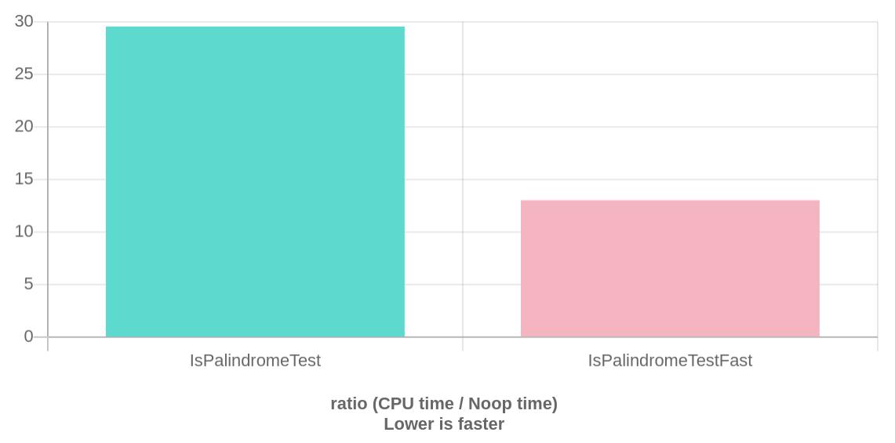

# Having fun with Palindrome words

This article is not as interesting and reusable as other, but I think it might still be a nice example of how you we can speed up your code reducing the amount of branches.

The `if` statement is very fast and usually we should not worry about its runtime cost, but there could be few cases in which avoiding it can provide a visible improvement.

## Coding interviews...

At the time of writing this article, I find myself in the wonderful world of job searching. As a consequence, you probably know what that implies: coding interviews!

I am fine with them, but the other day a person interviewing me asked the following question:

> Can you write a function to find if a string is a [palindrome](https://en.wikipedia.org/wiki/Palindrome)?

And I was thinking...


To be fair, I am sure he his a great guy and he was just breaking the ice. He certainly had the best intentions, but I think it could have been more productive for both of us to look at some real-world code I wrote in production instead!

Nevertheless, this is the answer:

```C++

bool IsPalindrome(const std::string& str)
{
    const size_t N = str.size();
    const size_t N_half = N / 2;
    for(size_t i=0; i<N_half; i++)
    {
        if( str[i] != str[N-1-i])
        {
            return false;
        }
    }
    return true;
}
```

Easy-peasy :)

Booooring!

Let's have some fun!

## A faster IsPalindrome()

The original version is apparently the best we can do:

- Zero copy.
- Stops the loop as soon as possible.
- Handles well all the corner cases.

But I realized that there is a way to make it faster, reducing the number of `if` clauses. 
This can be easily achieved using entire "words" instead, i.e. storing the single bytes in larger data types.

For instance, let's use the type `uint32_t` to manipulate 4 bytes at once.

The resulting implementation will be:

```C++
#include <byteswap.h>

inline bool IsPalindromeFast(const std::string& str)
{
    const size_t N = str.size();
    const size_t N_half = N / 2;
    size_t index = 0;
    
    for(size_t i=0; i<N_half; i+=4)
    {
        uint32_t word_left, word_right;

        // raw copy of 4 bytes
        //memcpy(&word_left, &str[i], 4);
        //memcpy(&word_right, &str[N - 4 - i], 4);
        // ... or ...
        // using reinterpret_cast
        word_left  = *reinterpret_cast<const uint32_t*>(&str[i]);
        word_right = *reinterpret_cast<const uint32_t*>(&str[N - 4 - i]);

        // function bswap_32 revert the endianess of the integer
        if( word_left != bswap_32(word_right))
        {
            return false;
        }
        index = i;
    }
    // remaining bytes. 
    for(size_t i=index+1 ; i<N_half; i++)
    {
        if( str[i] != str[N-1-i])
        {
            return false;
        }
    }
    return true;
}
```

What is going on here?

We are storing "blocks" (words) of 4 bytes and call the comparison operator only **once** for each word.

To reverse the order of the bytes in a "specular" way, we use the built-in function [bswap_32](https://man7.org/linux/man-pages/man3/bswap_32.3.html).

Note that the hand-made implemetation of this function is **equally fast** in my benchmarks.

```C++
inline uint32_t Swap(const uint32_t& val)
{
  union {
    char c[4];
    uint32_t n;
  } data;
  data.n = val;
  std::swap(data.c[0], data.c[3]);
  std::swap(data.c[1], data.c[2]);
  return data.n;
}
```

Benchmark:



For sufficiently long strings (more than 8 bytes), **the performance gain is about 2X**.

For very long strings, we might use words of 128 or 256 bits. This can be achieved using [SIMD](https://stackoverflow.blog/2020/07/08/improving-performance-with-simd-intrinsics-in-three-use-cases/), but this is not the purpose of this article.

## Summarizing

This is **not** a good example of "keep your code simple and readable, don't worry too much about optimizations".

I am mostly showing this for fun and to highlight that in **some** cases the cost of branches in our code can we non-negelgible and it might open the opportunity for some cool optimizations.
