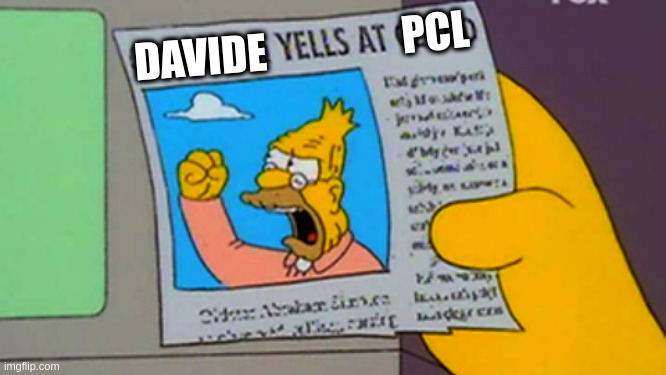
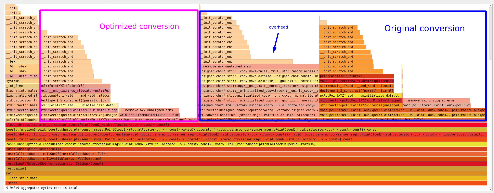

# Case study: convert ROS message to PCL

[Point Cloud Library (PCL)](https://pointclouds.org/) 
seems to be a cornucopia of opportunities for optimizations.

Even if this is a gratuitous criticism, let's remember what
**Bjarne Stroustrup** said:

> "There are only two kinds of languages: the ones people complain about and the ones nobody uses"

So, let's keep in mind that PCL has a **huge** role in 
allowing everyone to process pointclouds easily.
The developers and maintainers deserve all my respect for that!

Said that, let's jump into my next rant.




## Using pcl::fromROSMsg()

If you use PCL in ROS, the following code is your bread and butter:

```c++
void cloudCallback(const sensor_msgs::PointCloud2ConstPtr& msg)
{
  pcl::PointCloud<pcl::PointXYZ> cloud;
  pcl::fromROSMsg(*msg, cloud);

  //...
}
```

Now, I can not count the number of people complaining that
this conversion alone uses a lot of CPU!

I look at its implementation and at the results of Hotspot
(perf profiling) and a problem becomes immediately apparent:

```c++ linenums="5"
template<typename T>
void fromROSMsg(const sensor_msgs::msg::PointCloud2 &cloud, pcl::PointCloud<T> &pcl_cloud)
{
  pcl::PCLPointCloud2 pcl_pc2;
  pcl_conversions::toPCL(cloud, pcl_pc2);
  pcl::fromPCLPointCloud2(pcl_pc2, pcl_cloud);
}
```

We are transforming/copying the data twice:
- first, we convert from `sensor_msgs::msg::PointCloud2` to 
`pcl::PCLPointCloud2`
- then, from `pcl::PCLPointCloud2` to `pcl::PointCloud<T>`.

Digging into the implementation of `pcl_conversions::toPCL`, I found this:

```c++ linenums="4"
void toPCL(const sensor_msgs::msg::PointCloud2 &pc2, pcl::PCLPointCloud2 &pcl_pc2)
{
  copyPointCloud2MetaData(pc2, pcl_pc2);
  pcl_pc2.data = pc2.data;
}
```

Copying that raw data  from one type to the other is an overhead that can be easily avoided
with some refactoring.

This refactoring is not particularly interesting, because I bascially "copy and pasted"
the code of `pcl::fromPCLPointCloud2` to use a different input type.

Fast-forwarding to the solution, let's have a look at the results:



## What is the takeaway of this story?

Measure, measure, measure! Don't assume that the "smart people" implemented the best solution and that you can't actively do anything about it.

In this case, code clarity and reusing existing functions was prefered over performance.

But the impact of this decision is definitively too much to be ignored.


