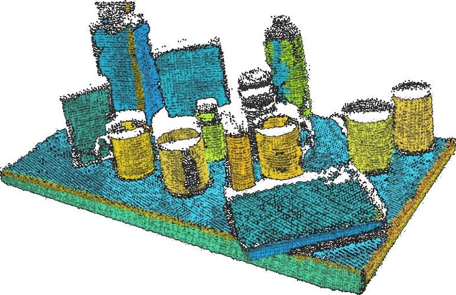

# 案例研究：更快地过滤点云

[Point Cloud Library (PCL)](https://pointclouds.org/) 是一个广泛应用于机器人、自动驾驶和 3D 感知等领域的流行库，对这些领域做出了**巨大贡献**。



它是一个庞然大物，有着超过 [12K 次提交和 5K 个 Github 星标](https://github.com/PointCloudLibrary/pcl)。

有约 [400 名贡献者](https://github.com/PointCloudLibrary/pcl/graphs/contributors)，你可能会认为很难在青睐度最高的函数内找到优化的机会。

**作者**: Muahahahaha (恶魔笑声)

## ConditionalRemoval 过滤器

我敢打赌，任何玩过 PCL 的人至少一次使用过 [pcl::ConditionalRemoval](https://pcl-tutorials.readthedocs.io/en/latest/remove_outliers.html)。

以下是来自[官方教程](https://pcl-tutorials.readthedocs.io/en/latest/remove_outliers.html)中的示例代码（稍作修改以提高清晰度）：

```C++
using namespace pcl;
auto range_cond  = std::make_shared<ConditionAnd<PointXYZ> ();
range_cond->addComparison ( 
    std::make_shared<FieldComparison<PointXYZ>("z", ComparisonOps::GT, 0.0));
range_cond->addComparison (
    std::make_shared<FieldComparison<PointXYZ>("z", ComparisonOps::LT, 1.0)));

// 创建过滤器
ConditionalRemoval<PointXYZ> condition_removal;
condition_removal.setCondition (range_cond);
condition_removal.setInputCloud (input_cloud);
// 运行过滤器
condition_removal.filter (*cloud_filtered);
```

> 基本上，我们创建了一个条件，该条件必须被给定的点满足才能保留在 PointCloud 中。 在此示例中，我们将两个比较添加到条件中：大于（GT）0.0 和小于（LT）1.0。 然后使用该条件来构建过滤器。

对不熟悉 PCL 的人来说，我来解释一下：

- 创建对象，表示“点的 Z 值必须大于 0.0”。
- 再创建一个对象，表示“点的 Z 值必须小于 1.0”。
- 将它们都加入到 `ConditionAnd` 中。
- 告诉 `ConditionalRemoval` 使用这个组合条件。
- 对输入点云应用过滤器以创建过滤后的点云。

现在想象一下，通常的点云中包含着数万个或更多的点。

好好想想吧：


认真想一下，如果你有一个如下所示的点的 **向量**：

```C++
// oversimplified, not the actual implementation
struct PointXYZ{
  float x;
  float y;
  float z; 
};
```

你想要创建另一个点云，其中包含所有满足以下条件的点：

      0.0 < point.z < 1.0
      
我的意思是，如果 **你问我**，这就是我会做的（因为我不是那么聪明）：

```C++
auto cloud_filtered = std::make_shared<PointCloud<PointXYZ>>();

for (const auto& point: input_cloud->points) 
{
  if( point.z > 0.0 && point.z < 1.0 )
  {
    cloud_filtered->push_back( point );
  }
}
``` 
我们将称之为 **“naive filter”**。

在展示让您刮目相看的基准测试之前（不用担心，我会展示给您看），我必须承认这是一个**不公平比较**，因为 `pcl` 过滤器在处理数据时执行了更多的检查以防止奇怪的边界情况。

但是不要忘记我们的条件被表达为：

```C++
pcl::FieldComparison<pcl::PointXYZ> ("z", pcl::ComparisonOps::GT, 0.0)));
pcl::FieldComparison<pcl::PointXYZ> ("z", pcl::ComparisonOps::LT, 1.0)));
```

如果您想一想，就会发现 **必须** 有某种形式的解析器 "存在"。

最简单的解析器实现当然是使用 `switch` 语句，但没有人会为每个这些万亿点中的 **每个** 都做到这一点...

[瞧！](https://github.com/PointCloudLibrary/pcl/blob/pcl-1.11.0/filters/include/pcl/filters/impl/conditional_removal.hpp#L98-L127)

事实上，对于云中的每个点，都调用了两个 `switch` 语句。

总结：这些函数试图使用这些 "可组合规则" 而变得过于聪明，这意味着实现本质上是 **缓慢的**。

我们无法挽救它们。尽管如此，我们可以替换它们 ;)

## Davide，给我速度和表达能力。

没问题，我的朋友！

由于 `pcl::FieldComparison` 本质上是有问题的（因为库中所有其他条件也是如此），由于它们的 `switch` 语句，让我自己编写一个 pcl::Condition（必须派生自 `pcl::ConditionBase`），如下所示：

```C++
template <typename PointT>
class GenericCondition : public pcl::ConditionBase<PointT>
{
public:
  typedef std::shared_ptr<GenericCondition<PointT>> Ptr;
  typedef std::shared_ptr<const GenericCondition<PointT>> ConstPtr;
  typedef std::function<bool(const PointT&)> FunctorT;

  GenericCondition(FunctorT evaluator): 
    pcl::ConditionBase<PointT>(),_evaluator( evaluator ) 
  {}

  virtual bool evaluate (const PointT &point) const {
    // just delegate ALL the work to the injected std::function
    return _evaluator(point);
  }
private:
  FunctorT _evaluator;
};
```

这就是您需要的全部代码，没有遗漏。

我只是将 `std::function<bool(const PointT&)>` 包装在 `pcl::ConditionBase` 中。仅此而已。
 
这是 **旧** 代码：

```C++
auto range_cond  = std::make_shared<ConditionAnd<PointXYZ> ();
range_cond->addComparison ( 
    std::make_shared<FieldComparison<PointXYZ>("z", ComparisonOps::GT, 0.0));
range_cond->addComparison (
    std::make_shared<FieldComparison<PointXYZ>("z", ComparisonOps::LT, 1.0)));
```

这是 **新** 代码，其中我的条件是以普通的代码表达出来的：

```C++   
auto range_cond = std::make_shared<GenericCondition<PointXYZ>>(
  [](const PointXYZ& point){ 
      return point.z > 0.0 && point.z < 1.0; 
  });
```

其余的代码没有改变！！！


## 让我们谈谈速度

您可以在[这里](https://github.com/facontidavide/CPP_Optimizations_Diary/tree/master/cpp/pcl_conditional_removal.cpp)找到复制我的测试的代码。

以下是基于我的示例云和 4 个过滤器（X 和 Y 的上限和下限）的基准测试：

```
-------------------------------------------------------------
Benchmark                   Time             CPU   Iterations
-------------------------------------------------------------
PCL_Filter            1403083 ns      1403084 ns          498
Naive_Filter           107418 ns       107417 ns         6586
PCL_Filter_Generic     668223 ns       668191 ns         1069
```

根据条件数量和点云大小，您的结果可能会有很大变化。

但要学习的经验教训是：

- "naive" 过滤器在许多情况下都是一个选择，并且速度非常快。
- 安全的 `pcl::ConditionalRemoval` 仍然可以使用，如果您只是放弃内置的 `pcl::Conditions`，并改用更简洁和易读的 `GenericCondition`。